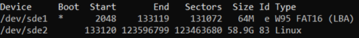
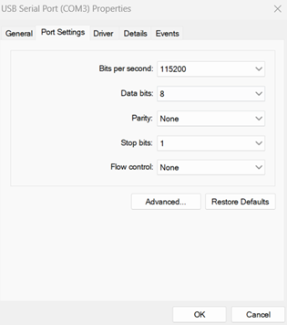
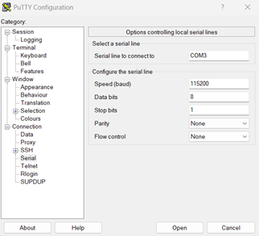
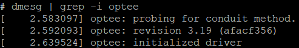
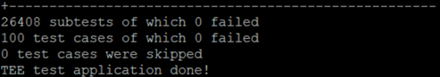

# OP-TEE Installation Instructions (Raspberry Pi 3 Model B v1.2)

These instructions walk through installing OP-TEE on a Raspberry Pi 3 Model B Version 1.2 using WSL on a Windows host, and then running attack scripts from the `ece595_testing` repository.

VIDEO DEMO LINK
https://youtu.be/bucMtfxy3FA

---

## Table of Contents

- [Overview](#op-tee-installation-instructions-raspberry-pi-3-model-b-v12)
- [Step 1: Install WSL on Your Windows Device](#step-1-install-wsl-on-your-windows-device)
- [Step 2: Prepare the Environment](#step-2-prepare-the-environment)
- [Step 3: Format the SD Card](#step-3-format-the-sd-card)
- [Step 4: Make the Filesystem](#step-4-make-the-filesystem)
- [Step 5: Setting Up PuTTY and UART Connections](#step-5-setting-up-putty-and-uart-connections)
- [Step 6: SSH into Raspberry Pi 3](#step-6-ssh-into-raspberry-pi3)
- [Step 7: Generate the Attack Modules for OP-TEE OS](#step-7-generate-the-attack-modules-for-optee-os)
- [Step 8: Run the Attack Scripts Against OP-TEE OS](#step-8-run-the-attack-scripts-against-op-tee-os)


---

## STEP 1: INSTALL WSL ON YOUR WINDOWS DEVICE

<details>
<summary>Click to expand Step 1 details</summary>

  a) Open PowerShell as an Administrator.

  b) Type:

  ```powershell
  wsl -install
  ```

  &nbsp;&nbsp;a. The default Ubuntu install will be sufficient.

  c) Restart your computer.

</details>

---

## STEP 2: PREPARE THE ENVIRONMENT

<details>
<summary>Click to expand Step 2 details</summary>

  a) Launch WSL.

  b) Type the following commands in order:

  &nbsp;&nbsp;a. Update packages:

  ```bash
  sudo apt update
  ```

  &nbsp;&nbsp;&nbsp;&nbsp;i. You will have to type your password. WSL will not ask again after this for a while, but if it does, re-enter your password.

  &nbsp;&nbsp;b. Install the base packages:

  ```bash
  sudo apt install -y \
  repo git build-essential ccache \
  python3 python3-venv python3-pip \
  libssl-dev libncurses5-dev \
  flex bison bc \
  device-tree-compiler \
  libglib2.0-dev libpixman-1-dev \
  unzip cpio wget
  ```

  &nbsp;&nbsp;c. Install dosfstools (for FAT filesystem tools):

  ```bash
  sudo apt-get install -y dosfstools
  ```

  &nbsp;&nbsp;d. Install pyelftools:

  ```bash
  sudo apt install python3-pyelftools
  ```

  &nbsp;&nbsp;e. Set the PATH:

  ```bash
  export PATH="/usr/local/sbin:/usr/local/bin:/usr/sbin:/usr/bin:/sbin:/bin"
  ```

  &nbsp;&nbsp;f. Create the OP-TEE directory:

  ```bash
  mkdir -p ~/optee_rpi3
  ```

  &nbsp;&nbsp;g. Change into the directory:

  ```bash
  cd ~/optee_rpi3
  ```

  &nbsp;&nbsp;h. Initialize the repo:

  ```bash
  repo init -u https://github.com/OP-TEE/manifest.git \
  -m rpi3.xml \
  -b 3.20.0
  ```

  &nbsp;&nbsp;i. Sync the repo:

  ```bash
  repo sync --no-clone-bundle
  ```

  &nbsp;&nbsp;j. Change into the build directory:

  ```bash
  cd ~/optee_rpi3/build
  ```

  &nbsp;&nbsp;k. Build the toolchains:

  ```bash
  make toolchains
  ```

  &nbsp;&nbsp;l. Build the full system:

  ```bash
  make -j"$(nproc)"
  ```

  &nbsp;&nbsp;&nbsp;&nbsp;i. THIS WILL TAKE A LONG TIME.

  &nbsp;&nbsp;&nbsp;&nbsp;ii. When this `make` is complete, you should have the following files:

  ```text
  ~/optee_rpi3/out-br/images/rootfs.cpio.gz
  ~/optee_rpi3/out/uboot.env
  ```

  &nbsp;&nbsp;&nbsp;&nbsp;iii. You can verify this by typing:

  ```bash
  ls ~/optee_rpi3/out-br/images/rootfs.cpio.gz
  ls ~/optee_rpi3/out/uboot.env
  ```

  &nbsp;&nbsp;m. Change into the Buildroot directory:

  ```bash
  cd ~/optee_rpi3/buildroot
  ```

  &nbsp;&nbsp;n. Run menuconfig:

  ```bash
  make O=../out-br menuconfig
  ```

  &nbsp;&nbsp;&nbsp;&nbsp;i. `System Configuration -> Root password ->` Type: `password`  
  &nbsp;&nbsp;&nbsp;&nbsp;ii. `Target Packages -> Enable "Show packages that are also provided by busybox" -> Exit`  
  &nbsp;&nbsp;&nbsp;&nbsp;iii. `Target Packages -> Development tools -> Enable "git" -> Exit`  
  &nbsp;&nbsp;&nbsp;&nbsp;iv. `Target Packages -> Networking applications -> Enable "dropbear" -> Exit`  
  &nbsp;&nbsp;&nbsp;&nbsp;v. `Target Packages -> Shell and utilities -> Enable "bash"`  
  &nbsp;&nbsp;&nbsp;&nbsp;vi. `Target Packages -> Shell and utilities -> Enable "sudo" -> Exit`  

  &nbsp;&nbsp;o. Build Buildroot (again; this will also take a long time):

  ```bash
  make O=../out-br -j"$(nproc)"
  ```

  &nbsp;&nbsp;&nbsp;&nbsp;i. THIS WILL TAKE A LONG TIME.

  &nbsp;&nbsp;p. Change back to the top-level OP-TEE directory:

  ```bash
  cd ~/optee_rpi3
  ```

</details>

---

## STEP 3: FORMAT THE SD CARD

<details>
<summary>Click to expand Step 3 details</summary>

  a) Plug your SD card into your computer using the adapter of your choice.

  b) Open WSL (if not open already).

  c) Open PowerShell as an **ADMINISTRATOR** (if not open already).

  d) Type the following commands in **PowerShell**:

  &nbsp;&nbsp;a. Install `usbipd`:

  ```powershell
  winget install usbipd
  ```

  &nbsp;&nbsp;&nbsp;&nbsp;i. This installs `usbipd` so you can allow WSL to interact with your SD card.

  &nbsp;&nbsp;b. List USB devices:

  ```powershell
  usbipd list
  ```

  &nbsp;&nbsp;&nbsp;&nbsp;i. This will display all devices connected to your computer. You can better identify what your SD card is by running this command, removing 
  &nbsp;&nbsp;&nbsp;&nbsp;the SD card from your computer and rerunning the command. Whichever device disappears and reappears is your SD card.  

  &nbsp;&nbsp;&nbsp;&nbsp;ii. YOU MUST NOTE WHAT THE BUSID OF THE SD CARD IS (**IMPORTANT**).
  
  &nbsp;&nbsp;c. Attach the SD card to WSL:

  ```powershell
  usbipd attach --wsl --busid <BUSID>
  ```

  &nbsp;&nbsp;&nbsp;&nbsp;i. DO NOT INCLUDE THE `<` AND `>` WHEN TYPING THE ABOVE.  
  &nbsp;&nbsp;&nbsp;&nbsp;ii. This will make the SD card visible to WSL.  
  &nbsp;&nbsp;&nbsp;&nbsp;iii. You should hear a Windows disconnect sound when performing this command.

  e) Type the following command in **WSL**:

  &nbsp;&nbsp;a. List block devices:

  ```bash
  lsblk
  ```

  &nbsp;&nbsp;&nbsp;&nbsp;i. This will display your SD card and other drives on your computer.  
  &nbsp;&nbsp;&nbsp;&nbsp;ii. YOU MUST BE ABSOLUTELY SURE WHICH DRIVE IS THE SD CARD OR YOU CAN WIPE/CORRUPT YOUR WINDOWS OPERATING SYSTEM.  
  &nbsp;&nbsp;&nbsp;&nbsp;iii. You can verify which is your SD card by unplugging it and running the command again and seeing what drive disappears. You will have to repeat Step 3.d.c to make the SD visible to WSL before running `lsblk`.

  f) Note the top directory name of your SD card.

  &nbsp;&nbsp;a. Mine is called `sde` but it can be different.  
  &nbsp;&nbsp;b. After running `lsblk` you may see subdirectories like `sde1` and `sde2`. Disregard those names for now and only concern yourself with the top directory. In my case, `sde`.

  g) Type the following commands in **WSL**:

  &nbsp;&nbsp;a. Start `fdisk` on your SD card:

  ```bash
  sudo fdisk /dev/<SD CARD NAME>
  ```

  &nbsp;&nbsp;&nbsp;&nbsp;i. For me, it will be:

  ```bash
  sudo fdisk /dev/sde
  ```

  &nbsp;&nbsp;&nbsp;&nbsp;ii. You may need to wait a little bit. The prompt `Command (m for help):` MUST APPEAR BEFORE CONTINUING.  
  &nbsp;&nbsp;&nbsp;&nbsp;iii. I will be referring to `<SD CARD NAME>` as `sde` from here on out.

  &nbsp;&nbsp;b. Type the following commands at the `Command (m for help):` prompt, followed by pressing the `Enter` key (do **NOT** double press Enter if the `Enter` key is a step):

  &nbsp;&nbsp;&nbsp;&nbsp;i. Create a new empty DOS partition table:

  ```text
  o
  ```

  &nbsp;&nbsp;&nbsp;&nbsp;ii. Create a new partition:

  ```text
  n
  ```

  &nbsp;&nbsp;&nbsp;&nbsp;iii. Choose primary partition:

  ```text
  p
  ```

  &nbsp;&nbsp;&nbsp;&nbsp;iv. Partition number:

  ```text
  1
  ```

  &nbsp;&nbsp;&nbsp;&nbsp;v. Press the `Enter` key (accept default first sector):

  ```text
  <Press Enter>
  ```

  &nbsp;&nbsp;&nbsp;&nbsp;vi. Specify the last sector / size of the partition:

  ```text
  +64M
  ```

  &nbsp;&nbsp;&nbsp;&nbsp;1. If it asks to remove any signature, type:

  ```text
  y
  ```

  &nbsp;&nbsp;&nbsp;&nbsp;vii. Create a second partition:

  ```text
  n
  ```

  &nbsp;&nbsp;&nbsp;&nbsp;viii. Choose primary partition:

  ```text
  p
  ```

  &nbsp;&nbsp;&nbsp;&nbsp;ix. Partition number:

  ```text
  2
  ```

  &nbsp;&nbsp;&nbsp;&nbsp;x. Press the `Enter` key (accept default first sector):

  ```text
  <Press Enter>
  ```

  &nbsp;&nbsp;&nbsp;&nbsp;xi. Press the `Enter` key again (accept default last sector):

  ```text
  <Press Enter>
  ```

  &nbsp;&nbsp;&nbsp;&nbsp;1. If it asks to remove any signature, type:

  ```text
  y
  ```

  &nbsp;&nbsp;&nbsp;&nbsp;xii. Change partition type:

  ```text
  t
  ```

  &nbsp;&nbsp;&nbsp;&nbsp;xiii. Select partition 1:

  ```text
  1
  ```

  &nbsp;&nbsp;&nbsp;&nbsp;xiv. Set type to `e`:

  ```text
  e
  ```

  &nbsp;&nbsp;&nbsp;&nbsp;1. This should print:

  ```text
  Changed type of partition 'Linux' to 'W95 FAT16 (LBA)'
  ```

  &nbsp;&nbsp;&nbsp;&nbsp;xv. Toggle bootable flag:

  ```text
  a
  ```

  &nbsp;&nbsp;&nbsp;&nbsp;xvi. Select partition 1:

  ```text
  1
  ```

  &nbsp;&nbsp;&nbsp;&nbsp;xvii. Print the partition table:

  ```text
  p
  ```

  &nbsp;&nbsp;&nbsp;&nbsp;1. This should print something similar to this.

  

  &nbsp;&nbsp;&nbsp;&nbsp;xviii. Write changes and exit:

  ```text
  w
  ```

  &nbsp;&nbsp;c. List the partition table:

  ```bash
  sudo fdisk -l /dev/sde
  ```

  &nbsp;&nbsp;d. List the device nodes:

  ```bash
  ls /dev/sde*
  ```

  &nbsp;&nbsp;&nbsp;&nbsp;i. This command should print three directories:

  ```text
  /dev/sde
  /dev/sde1
  /dev/sde2
  ```

  &nbsp;&nbsp;&nbsp;&nbsp;ii. DO NOT PROCEED IF ALL THREE DIRECTORIES DO NOT APPEAR.

</details>

---

## STEP 4: MAKE THE FILESYSTEM

<details>
<summary>Click to expand Step 4 details</summary>

  a) Type the following commands in WSL (directory `~/optee_rpi3`):

  &nbsp;&nbsp;a. Create a FAT filesystem on the first partition:

  ```bash
  sudo mkfs.vfat -F16 -n BOOT /dev/sde1
  ```

  &nbsp;&nbsp;b. Create an ext4 filesystem on the second partition:

  ```bash
  sudo mkfs.ext4 -L rootfs /dev/sde2
  ```

  &nbsp;&nbsp;&nbsp;&nbsp;i. This command may take some time to complete.

  &nbsp;&nbsp;c. Change to your home directory:

  ```bash
  cd ~
  ```

  &nbsp;&nbsp;d. Create mount points:

  ```bash
  sudo mkdir -p /media/boot /media/rootfs
  ```

  &nbsp;&nbsp;e. Mount the BOOT partition:

  ```bash
  sudo mount /dev/sde1 /media/boot
  ```

  &nbsp;&nbsp;f. Mount the root filesystem partition:

  ```bash
  sudo mount /dev/sde2 /media/rootfs
  ```

  &nbsp;&nbsp;g. Change to `/media`:

  ```bash
  cd /media
  ```

  &nbsp;&nbsp;h. Extract the boot files from the rootfs image to the BOOT partition:

  ```bash
  sudo gunzip -cd ~/optee_rpi3/out-br/images/rootfs.cpio.gz | \
  sudo cpio -idmv "boot/*"
  ```

  &nbsp;&nbsp;i. Copy the U-Boot environment file (ignore errors if it does not exist):

  ```bash
  sudo cp ~/optee_rpi3/out/uboot.env /media/boot/ 2>/dev/null || true
  ```

  &nbsp;&nbsp;j. Unmount the BOOT partition:

  ```bash
  sudo umount /media/boot
  ```

  &nbsp;&nbsp;k. Change to the rootfs mount point:

  ```bash
  cd /media/rootfs
  ```

  &nbsp;&nbsp;l. Extract the full rootfs:

  ```bash
  sudo gunzip -cd ~/optee_rpi3/out-br/images/rootfs.cpio.gz | \
  sudo cpio -idmv
  ```

  &nbsp;&nbsp;m. Remove any existing boot files from the rootfs:

  ```bash
  sudo rm -rf /media/rootfs/boot/*
  ```

  &nbsp;&nbsp;n. Change to `/media`:

  ```bash
  cd /media
  ```

  &nbsp;&nbsp;o. Unmount the rootfs partition:

  ```bash
  sudo umount /media/rootfs
  ```

</details>

---

## STEP 5: SETTING UP PUTTY AND UART CONNECTIONS

<details>
<summary>Click to expand Step 5 details</summary>

  a) ENSURE THE RASPBERRY PI IS TURNED OFF.

  b) After Step 4, the SD card can be inserted into the Raspberry Pi.

  c) Install PuTTY on your Windows device from the Microsoft Store:

  ```text
  https://apps.microsoft.com/detail/XPFNZKSKLBP7RJ?hl=en-US&gl=US&ocid=pdpshare
  ```

  d) You must use a USB-TTL adapter set to **3.3V (NOT 5V)**.

  e) Connect ONLY the following three wires on the USB-TTL adapter to the RPI 3 Model B Version 1.2:

  &nbsp;&nbsp;a. Adapter GND -> RPI GND (Pin 6)  
  &nbsp;&nbsp;b. Adapter RX -> RPI TXD0 (Pin 8, GPIO14)  
  &nbsp;&nbsp;c. Adapter TX -> RPI RXD0 (Pin 10, GPIO15)  

  f) DO NOT CONNECT ANYTHING ELSE BESIDES THESE THREE WIRES. DO NOT CONNECT ANY VCC/5V PINS TO THE RPI.

  g) Open **Device Manager** on your Windows device.

  &nbsp;&nbsp;a. Click the drop-down menu for **Ports (COM & LPT)**.

  

  h) Connect the USB-TTL adapter to your computer.

  &nbsp;&nbsp;a. This will refresh your Device Manager window. Go back to the drop-down menu for **Ports (COM & LPT)** and a new device should appear.  
  &nbsp;&nbsp;b. Right-click the new device and click **Properties**.  

  &nbsp;&nbsp;&nbsp;&nbsp;i. Click **Port Setting**.  
  &nbsp;&nbsp;&nbsp;&nbsp;ii. Set the parameters to the values shown in your lab screenshot and click **OK**.  

  &nbsp;&nbsp;c. NOTE THE NAME OF THE **COM** PORT OF THE NEW DEVICE.

  &nbsp;&nbsp;&nbsp;&nbsp;i. My new device is called `USB Serial Port`.  
  &nbsp;&nbsp;&nbsp;&nbsp;ii. My COM port of the new device is `COM3`.  
  &nbsp;&nbsp;&nbsp;&nbsp;iii. I will be referring to `COM3` for future declarations.

  i) Open PuTTY on your Windows device.

  &nbsp;&nbsp;a. Select the **Serial** tab in the **Category** section.

  &nbsp;&nbsp;&nbsp;&nbsp;i. This is located in `Connection -> SSH -> Serial`.

  &nbsp;&nbsp;b. Set the Serial parameters to match your COM port and baud rate (e.g., COM3, 115200).

  

  &nbsp;&nbsp;c. Click **Open**.

  &nbsp;&nbsp;&nbsp;&nbsp;i. A black terminal should open with **NO TEXT**.

  j) TURN ON THE RASPBERRY PI.

  &nbsp;&nbsp;a. An HDMI connection from the RPI to a monitor will **NOT** work. You must interact with the OP-TEE OS through PuTTY in Windows.

  k) Wait a few moments and it will request you to enter a `buildroot login`.

  &nbsp;&nbsp;a. Type:

  ```text
  root
  ```

  l) You now have access to OP-TEE.

  m) In the PuTTY terminal, type the following commands to ensure OP-TEE was installed correctly:

  &nbsp;&nbsp;a. Check for OP-TEE in the kernel log:

  ```bash
  dmesg | grep -i optee
  ```

  &nbsp;&nbsp;&nbsp;&nbsp;i. This should print OP-TEE-related messages.

  

  &nbsp;&nbsp;b. Run the OP-TEE test suite:

  ```bash
  xtest
  ```

  &nbsp;&nbsp;&nbsp;&nbsp;i. This command will take some time to complete.  
  &nbsp;&nbsp;&nbsp;&nbsp;ii. The final print should match the expected successful test summary.

  

</details>

---

## STEP 6: SSH INTO RASPBERRY Pi3

<details>
<summary>Click to expand Step 6 details</summary>

  a) Connect your Raspberry Pi 3 to the internet using an Ethernet cable.

  b) In PuTTY (serial console to the Pi), type:

  &nbsp;&nbsp;a. Show IP address:

  ```bash
  ip addr
  ```

  &nbsp;&nbsp;&nbsp;&nbsp;i. This will display the IP address of your Raspberry Pi 3.  
  &nbsp;&nbsp;&nbsp;&nbsp;ii. It will be the numbers following `inet`. It should begin with `192.168.`.

  &nbsp;&nbsp;b. Change the root password:

  ```bash
  passwd
  ```

  &nbsp;&nbsp;&nbsp;&nbsp;i. This will allow you to change the password for `root` on your Raspberry Pi 3.  

  &nbsp;&nbsp;c. Type in your new password.

  &nbsp;&nbsp;&nbsp;&nbsp;i. It will ask you to type in your password a second time.

  c) Open a **NEW WSL terminal** and type:

  &nbsp;&nbsp;a. SSH into the Raspberry Pi 3 (replace `[ip addr]` with the address from Step 6.b.a):

  ```bash
  ssh root@[ip addr]
  ```

  &nbsp;&nbsp;&nbsp;&nbsp;i. OMIT the brackets and type in the IP address noted in Step 6.b.a.

  &nbsp;&nbsp;b. It will prompt you to type in your password. This will be the password you set in Step 6.b.b.

  d) You should now be able to access the Raspberry Pi 3 from the NEW WSL terminal!

</details>

---

## STEP 7: GENERATE THE ATTACK MODULES FOR OPTEE OS

<details>
<summary>Click to expand Step 7 details</summary>

  a) In the **ORIGINAL** WSL terminal, type:

  &nbsp;&nbsp;a. Clone the `ece595_testing` repository:

  ```bash
  git clone https://github.com/smit4351/ece595_testing
  ```

  &nbsp;&nbsp;&nbsp;&nbsp;i. This will prompt you to enter your GitHub username and password if access to the repo has been granted to you.  
  &nbsp;&nbsp;&nbsp;&nbsp;ii. Your password must be a **token** generated in GitHub.

  &nbsp;&nbsp;b. Change into the repository:

  ```bash
  cd ece595_testing
  ```

  &nbsp;&nbsp;c. Set the architecture:

  ```bash
  export ARCH=arm64
  ```

  &nbsp;&nbsp;d. Set the cross-compiler (auto-detected from OP-TEE toolchains):

  ```bash
  export CROSS_COMPILE="$(find ~/optee_rpi3/toolchains -type f -name 'aarch64*-gcc' | head -n1 | sed 's/gcc$//')"
  ```

  &nbsp;&nbsp;e. Set the kernel source directory:

  ```bash
  export KERNEL_SRC=~/optee_rpi3/linux
  ```

  &nbsp;&nbsp;f. Change into the kernel source directory:

  ```bash
  cd "$KERNEL_SRC"
  ```

  &nbsp;&nbsp;g. Prepare the kernel for module building:

  ```bash
  make ARCH=$ARCH CROSS_COMPILE=$CROSS_COMPILE modules_prepare
  ```

  &nbsp;&nbsp;h. Change into the kernel modules directory in the repo:

  ```bash
  cd ~/ece595_testing/kernel_modules
  ```

  &nbsp;&nbsp;i. Build the kernel modules:

  ```bash
  make -C "$KERNEL_SRC" M=$PWD ARCH=$ARCH CROSS_COMPILE=$CROSS_COMPILE modules
  ```

  &nbsp;&nbsp;j. Change back to the repository root:

  ```bash
  cd ~/ece595_testing
  ```

  &nbsp;&nbsp;k. Copy the entire `ece595_testing` directory to the Raspberry Pi 3 (replace IP as needed):

  ```bash
  scp -r ./* root@[ip addr]:/root/ece595_testing/
  ```

  &nbsp;&nbsp;&nbsp;&nbsp;i. This will copy over the `~/ece595_testing` directory to the Raspberry Pi 3.  
  &nbsp;&nbsp;&nbsp;&nbsp;ii. You will have to enter the password you set for the RPi3 in Step 6.b.b.

  b) In the **SECOND** WSL terminal (the one that is SSH’d into the Raspberry Pi 3), type:

  &nbsp;&nbsp;a. List files in `/root`:

  ```bash
  ls
  ```

  &nbsp;&nbsp;&nbsp;&nbsp;i. Verify that the `ece595_testing` directory was copied over.

  &nbsp;&nbsp;b. Change into the directory:

  ```bash
  cd /root/ece595_testing
  ```

  &nbsp;&nbsp;c. Change into the `pi_attack_runner` subdirectory:

  ```bash
  cd /root/ece595_testing/pi_attack_runner
  ```

  &nbsp;&nbsp;d. Edit `config.sh`:

  ```bash
  vi config.sh
  ```

  &nbsp;&nbsp;&nbsp;&nbsp;i. Press `i` to enter **INSERT** mode so you can make changes to this file.  
  &nbsp;&nbsp;&nbsp;&nbsp;ii. Find:

  ```bash
  MODULES_DIR="${MODULES_DIR:-/tmp/attacks}"
  ```

  &nbsp;&nbsp;&nbsp;&nbsp;iii. Replace that line with:

  ```bash
  MODULES_DIR="/root/ece595_testing/kernel_modules"
  ```

  &nbsp;&nbsp;&nbsp;&nbsp;iv. Press the `ESC` key.  
  &nbsp;&nbsp;&nbsp;&nbsp;v. Type:

  ```text
  :wq
  ```

  &nbsp;&nbsp;&nbsp;&nbsp;vi. This will ensure that the correct path is used to source the attack scripts.

</details>

---

## STEP 8: RUN THE ATTACK SCRIPTS AGAINST OP TEE OS

<details>
<summary>Click to expand Step 8 details</summary>

  a) ALL OF THE FOLLOWING COMMANDS WILL BE PERFORMED IN THE WSL TERMINAL THAT IS CURRENTLY SSH’d INTO THE RASPBERRY PI 3.

  b) TO RUN THE CACHE TIMING ATTACK, TYPE:

  &nbsp;&nbsp;a. Change into the attack runner directory:

  ```bash
  cd /root/ece595_testing/pi_attack_runner
  ```

  &nbsp;&nbsp;b. Run the cache timing attack:

  ```bash
  bash execute_attack.sh --module cache_timing_attack --verbose
  ```

  c) TO RUN THE PERIPHERAL ISOLATION TEST ATTACK, TYPE:

  &nbsp;&nbsp;a. Change into the attack runner directory:

  ```bash
  cd /root/ece595_testing/pi_attack_runner
  ```

  &nbsp;&nbsp;b. Run the peripheral isolation test:

  ```bash
  bash execute_attack.sh --module peripheral_isolation_test --verbose
  ```

  d) TO RUN THE DMA ATTACK, TYPE:

  &nbsp;&nbsp;a. Change into the attack runner directory:

  ```bash
  cd /root/ece595_testing/pi_attack_runner
  ```

  &nbsp;&nbsp;b. Run the DMA attack:

  ```bash
  bash execute_attack.sh --module dma_attack --verbose
  ```

  e) ALL ATTACK LOGS ARE SAVED IN:

  &nbsp;&nbsp;a. List the log files:

  ```bash
  ls -lh /var/log/optee_attacks
  ```

  &nbsp;&nbsp;b. To view them, type:

  &nbsp;&nbsp;&nbsp;&nbsp;i. View cache timing attack logs:

  ```bash
  cat /var/log/optee_attacks/attack_cache_timing_attack_*.txt
  ```

  &nbsp;&nbsp;&nbsp;&nbsp;ii. View peripheral isolation test logs:

  ```bash
  cat /var/log/optee_attacks/attack_peripheral_isolation_test_*.txt
  ```

  &nbsp;&nbsp;&nbsp;&nbsp;iii. View DMA attack logs:

  ```bash
  cat /var/log/optee_attacks/attack_dma_attack_*.txt
  ```

</details>
